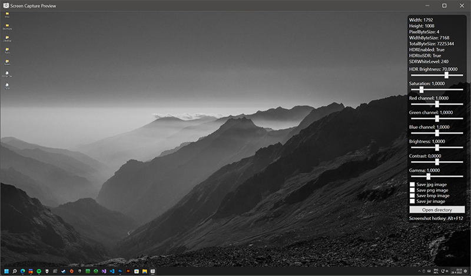

## Description
ScreenCaptureDLL can be used in your application through dll import to capture your screen to an image.

ScreenCapturePreview gives you a live screen capture preview to see what you can expect.

ScreenCaptureNow saves a screenshot directly to file using command line arguments:
- -MonitorId=0, 1, 2, 3...
- -ImageFormat=PNG, JPG, BMP or JXR
- -ImageQuality=0-100 (Only works with JPG format)
- -ImageSaveFolder="E:\Screenshots" (Defaults to app directory)
- -MaxPixelDimension=0 (Maximum pixel width or height)
- -HDRtoSDR=True (False only works with JXR format when HDR is enabled)
- -HDRBrightness=70.00 (Adjust HDR brightness to displayed content)
- -Saturation=1.00 (Adjust color saturation)
- -RedChannel=1.00 (Adjust red color channel)
- -GreenChannel=1.00 (Adjust green color channel)
- -BlueChannel=1.00 (Adjust blue color channel)
- -Brightness=1.00 (Adjust capture brightness)
- -Contrast=0.00 (Adjust capture contrast)
- -Gamma=1.00 (Adjust capture gamma)

## Features
- Save screencapture as BMP, JPG, PNG or JXR.
- HDR to SDR tonemapping through shader.

## Known issues
- Some content with HDR or DRM might not be captured.

## Requirements
- Microsoft Visual C++ Redistributable installed.

## Support and bug reporting
When you are walking into any problems or a bug you can go to my help page at https://help.arnoldvink.com so I can try to help you out and get everything working.

## Developer donation
If you appreciate my project and want to support me you can make a donation through https://donation.arnoldvink.com